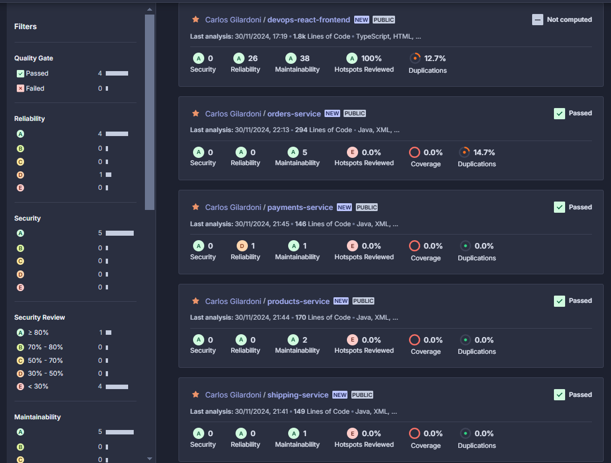

# Proyecto Obligatorio DEVOPS 2024S2 - CARLOS GILARDONI, GUILLERMO RECOBA

/*INSERTAR IMAGEN DE ORT*/

# 1. Presentación del problema

Una empresa líder en retail se encuentra en la transición digital, los desafíos que se le presentaron evidenciaron la brecha cultural entre los equipos de desarrollo y operaciones. Durante el lanzamiento de una aplicación innovadora destinada a revolucionar la experiencia de compra de los usuarios, los despliegues frecuentes generaron errores y caídas, afectando la experiencia del usuario. Esto reflejó una desconexión en la comunicación y en la responsabilidad compartida, donde desarrollo priorizaba la velocidad mientras operaciones se centraba en la estabilidad. Reconociendo que el problema no era técnico sino organizativo, se identificó la necesidad de fomentar una cultura colaborativa. Este cambio busca alinear objetivos y mejorar procesos, sentando las bases para una operación ágil y resiliente. Por lo tanto, se le solicita al equipo de proyecto un plan de acción detallado que no solo aborde las ineficiencias operativas evidentes sino que también fomente un ambiente de colaboración, transparencia y aprendizaje continuo. Se espera que mediante la solución planteada la empresa no sólo supere los obstáculos actuales sino que también sentará las bases para una agilidad y resiliencia operativa a largo plazo, asegurando así su posición competitiva en el mercado.

# 2. Solución planteada
Implementamos un modelo DevOps que nos permite maximizar los beneficios de esta metodología, reduciendo costos mediante el uso de servicios en la nube, donde solo pagamos por lo que utilizamos. Esto también nos proporciona una infraestructura escalable y flexible para adaptarnos a cualquier eventualidad, disminuye el time-to-market y optimiza los procesos gracias a la configuración como Infraestructura como Código (IaC), lo que elimina errores humanos y facilita la implementación de CI/CD.

Para ello, utilizamos AWS como proveedor principal de servicios en la nube, GitHub como repositorio de código y GitHub Actions para el CI/CD de todos los repositorios, excepto el de infraestructura. Además, cada pipeline de los microservicios incluye el análisis estático de código con SonarQube y pruebas automatizadas realizadas con Postman, garantizando así la calidad y confiabilidad de las aplicaciones.

Mediante la implementación de un modelo DevOps, buscamos aprovechar al máximo los beneficios que nos provee esta metodología para así solucionar o disminuir considerablemente los problemas de comunicación entre los equipos, además de reducir los costos gracias a que al usar los servicios de Cloud solo se nos computa los gastos de lo que utilizamos, tener a disposición una infraestructura escalable y flexible para estar prevenidos ante cualquier acontecimiento, disminuir el time-to-market, etc. Todo esto es además configurado como Infraestructura como código (IaC) para normalizar el tiempo en que lleven los procesos quitando el factor del error humano y así facilitando los procesos de CI/CD.

# 3. Herramientas utilizadas

- **Azure DevOps** - Tablero Kanban para planificación y seguimiento de tareas
- **GitHub** - Manejo de Git/Versionado de código
- **GitHub Actions** - Manejo del CI/CD
- **Terraform** - Manejo de la IaC
- **DockerHub** - Almacenamiento y distribución de imágenes Docker
- **Amazon Web Services** - Plataforma de servicios Cloud
- **Amazon Elastic Container Service** - Orquestador de contenedores
- **SonarQube** - Análisis de código estático
- **Lambda** - Servicio serverless 

# 4. Flujos de trabajo

## 4.1 Planificacion y seguimiento de tareas

Utilizamos el tablero de Kanban de Azure DevOps para organizarnos de una manera estructurada. Con 3 columnas en donde íbamos agrupando las tareas en "To Do", "In progress" y "Completed". Los tableros Kanban no tienen mucha complicación, ya que son fáciles de entender a simple vista. La elección de utilizar Azure DevOps fue simplemente por practicidad, ya que teníamos las cuentas creadas y habíamos tenido un acercamiento en el práctico de Scrum.

## 4.2 Versionado de código

GitHub fue nuestra elección para compartir y versionar el código. La elección se basó en experiencia previa de ambos en la utilización de dicha herramienta, además de la compatibilidad con infinidad de herramientas del mundo de DevOps. Además, nos permite la utilización directa de GitHub Actions para la implementación del CI/CD.

Elegimos el flujo de trabajo **GitFlow** con las 3 ramas fijas : main, develop y staging. Esta elección se debió a la capacidad que nos brinda para organizar de manera eficiente el desarrollo y asegurar la calidad del código a medida que avanzamos en el proyecto, pudiendo llevar un control estricto del versionado del código para poder restaurar en caso de que suceda algun inconveniente. Además nos encontramos más familiarizados con este flujo.

Links de los repositorios de microservicios y de frontend : 

- Payments service: https://github.com/carlosgilard/payments-service
- Shipping service: https://github.com/carlosgilard/shipping-service
- Product service: https://github.com/carlosgilard/products-service
- Orders service: https://github.com/carlosgilard/orders-service
- Frontend: https://github.com/carlosgilard/devops-react-frontend

## 4.3 CI/CD

Como mencionamos en el punto anterior, elegimos GitHub Actions como nuestra herramienta de CI/CD por su integración nativa con GitHub, lo que facilita la automatización de flujos de trabajo directamente en los repositorios de código. Al estar diseñado específicamente para GitHub, no requiere configuraciones adicionales para conectar el código fuente con las pipelines, simplificando y agilizando el proceso de despliegue.

En cada uno de los pipelines de los microservicios, realizamos pruebas de código estático, ejecutamos la aplicación y la dockerizamos, subimos la imagen generada a un repositorio público, y posteriormente llevamos a cabo pruebas automatizadas con Postman para validar el correcto funcionamiento de los microservicios.

## 4.4 Infraestructura

Elegimos Terraform como herramienta de despliegue de Infraestructura como Código (IaC) debido a su flexibilidad y compatibilidad con múltiples proveedores de nube. Terraform nos permite describir la infraestructura deseada en archivos de configuración que son fáciles de leer, versionar y mantener, asegurando consistencia y replicabilidad en los entornos de desarrollo, pruebas y producción.

Tiene la capacidad de gestionar el ciclo de vida completo de los recursos, desde la creación hasta la eliminación, facilita la automatización y minimiza errores humanos. Además, su soporte para múltiples proveedores, como AWS, Azure y Google Cloud, y que haya sido la única herramienta de IaC con una guía en los prácticos, facilitaron nuestra decisión.

### 4.4.1 Microservicios
Se utiliza como entrada las VPC y subnets recibidas a través de variables, se utilizan por defectos las predeterminadas de la cuenta de AWS Learner Lab de Guillermo. Para cada microservicio y entorno asociado, se crean de manera automatizada los siguientes recursos:

- Un load balancer específico para cada microservicio.
- Un target group asociado a cada balanceador.
- Un listener para cada balanceador.
- Un cluster ECS para gestionar las task de los microservicios.
- Una task definition para definir la configuración del contenedor del microservicio. Cada task definition utiliza la imagen que corresponda al microservicio y al ambiente.
- Un ECS service por cada microservicio y entorno, encargado de mantener la ejecución de las tareas en el cluster. Para cada microservicio se ejecutan 2 instancias del contenedor.

### 4.4.2 Frontend
Se generan los siguientes recursos: 
Buckets S3 (aws_s3_bucket) : uno para cada ambiente, aqui se almacena el código de la aplicación frontend compilado.
Control de acceso público (aws_s3_bucket_public_access_block) : configuración para permitir el acceso público a cada uno de los sitios.
Configuración de website estático (aws_s3_bucket_website_configuration.static_website): hace que los buckets funcionen como un alojamiento de un sitio web estático.
Versionado de objetos (aws_s3_bucket_versioning.versioning_example): para mantener un historial de cambios de los buckets.
Política de acceso (aws_s3_bucket_policy.allow_access_from_another_account): políticas de acceso, en este caso otorga todos los permisos a todos los usuarios.

Además, se implementa una función Lambda , hecha para activarse cuando se actualiza el archivo index.html en cualquiera de los buckets S3 (estas actualizaciones se gestionan desde el flujo de CI/CD). La función se configura con los siguientes recursos:

Permiso Lambda (aws_lambda_permission.allow_s3): permite que los eventos de los buckets S3 invoquen la función Lambda.
Notificación del bucket S3 (aws_s3_bucket_notification.bucket_notification): establece la relación entre las actualizaciones del bucket y la ejecución de la función Lambda.
Este enfoque automatiza la gestión de contenidos estáticos y facilita la integración continua entre los buckets S3 y las funciones Lambda.

Se es

## 4.5 Análisis de codigo estático

Al realizar el análisis de las 4 aplicaciones Backend, los resultados concluyeron en que había algunos "Code Smells" que son indicios de que el código podría mejorarse para ser más limpio, mantenible o legible, pero no necesariamente representan un error crítico que afecte su ejecución. El análisis encontró algunas lineas de código duplicadas que se podrian tratar con el uso de variables, algunas anidaciones con un uso excesivo del "if"s y hacían más complicada la su comprensión a simple vista, y también algunas funciones repetidas en las distintas aplicaciones que no solo no tenían código, sino que tampoco tenían siquiera un comentario del porqué estaban vacias.

En la aplicación de Frontend de React tampoco se encontraron errores críticos pero si encontró uno que se repitió en muchas ocasiones y se refiere a un problema en el estilo del código relacionado con el espaciado entre elementos, que dificulta la legibilidad y mantenibilidad, en especial con el uso de las etiquetas , la solución es tan simple como eliminar los espacios innecesarios en el codigo. Por último tambien encontró imports sin utilizar, que simplemente con borrar los imports se solucionaria para asi evitar dependencias innecesarias y mantener el código un poco más limpio.

## 4.6 Prueba Extra (Prueba Automatizada con Postman)

En los pasos de CI/CD de GitHub Actions, agregamos que se realize una prueba automatizada de Postman para comprobar que los endpoints estan funcionando de manera correcta. En este caso, el reporte muestra la ejecución de pruebas en el endpoint /shipping/c, el cual respondió correctamente con un código de estado 200 y un tiempo promedio de respuesta de 165ms. 

Se realizaron cuatro verificaciones: que el código de respuesta sea 200, que la respuesta incluya los campos status e id, y que ambos sean cadenas no vacías. Todas las pruebas pasaron exitosamente, lo que confirma que el endpoint está funcionando correctamente, devuelve los datos esperados y tiene un tiempo de respuesta adecuado.

## 4.7 Tarea con Servicio Serverless

Para esta tarea elegimos un servicio de AWS Lambda, al S3 Bucket donde se despliega la aplicación React le agregamos en las propiedades, una Notificación de Evento que detecta cuando se realiza el deploy dentro del Bucket y dispara la Funcion Lambda que esta configurada en Python para enviarnos un mail con la notificación que de la aplicación React fue desplegada con éxito. 

El Amazon Simple Email Service (SES) no estaba disponible por una cuestion de permisos, por lo que encontramos otra solución, simple pero funcional. Mediante SMTP (Simple Mail Transfer Protocol) de Gmail logramos configurar el envio del correo. 

