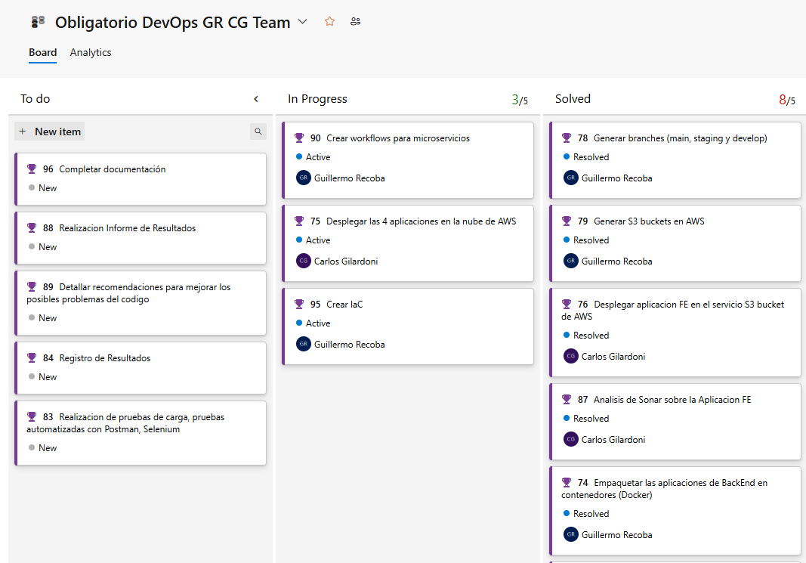

# Documentacion de Obligatorio DevOps 2024

Guillermo Recoba
Carlos Gilardoni

Universidad ORT

# 1. Presentación del problema

Una empresa líder en retail se encuentra en la transición digital, los desafíos que se le presentaron evidenciaron la brecha cultural entre los equipos de desarrollo y operaciones. Durante el lanzamiento de una aplicación innovadora destinada a revolucionar la experiencia de compra de los usuarios, los despliegues frecuentes generaron errores y caídas, afectando la experiencia del usuario. Esto reflejó una desconexión en la comunicación y en la responsabilidad compartida, donde desarrollo priorizaba la velocidad mientras operaciones se centraba en la estabilidad. Reconociendo que el problema no era técnico sino organizativo, se identificó la necesidad de fomentar una cultura colaborativa. Este cambio busca alinear objetivos y mejorar procesos, sentando las bases para una operación ágil y resiliente. Por lo tanto, se le solicita al equipo de proyecto un plan de acción detallado que no solo aborde las ineficiencias operativas evidentes sino que también fomente un ambiente de colaboración, transparencia y aprendizaje continuo. Se espera que mediante la solución planteada la empresa no sólo supere los obstáculos actuales sino que también sentará las bases para una agilidad y resiliencia operativa a largo plazo, asegurando así su posición competitiva en el mercado.

# 2. Solución planteada

Mediante la implementación de un modelo DevOps, buscamos aprovechar al máximo los beneficios que nos provee esta metodología para así solucionar o disminuir considerablemente los problemas de comunicación entre los equipos, además de reducir los costos gracias a que al usar los servicios de Cloud solo se nos computa los gastos de lo que utilizamos, tener a disposición una infraestructura escalable y flexible para estar prevenidos ante cualquier acontecimiento, disminuir el time-to-market, etc. Todo esto es además configurado como Infraestructura como código (IaC) para normalizar el tiempo en que lleven los procesos quitando el factor del error humano y así facilitando los procesos de CI/CD.

# 3. Herramientas utilizadas

- **Azure DevOps** - Tablero Kanban
- **Terraform** - Manejo de la IaC
- **GitHub** - Manejo de Git/Versionado de código
- **GitHub Actions** - Manejo del CI/CD
- **DockerHub** - Almacenamiento y distribución de imágenes Docker
- **Amazon Web Services** - Plataforma de servicios Cloud
- **Amazon Elastic Container Service** - Orquestador de contenedores
- **SonarQube** - Análisis de código estático
- **Lambda** - Servicio serverless (por decidir/puede cambiar)

## 3.1 Azure DevOps

Utilizamos el tablero de Kanban de Azure DevOps para organizarnos de una manera estructurada. Con 3 columnas en donde íbamos agrupando las tareas en "To Do", "In progress" y "Completed". Los tableros Kanban no tienen mucha complicación, ya que son fáciles de entender a simple vista. La elección de utilizar Azure DevOps fue simplemente por practicidad, ya que teníamos las cuentas creadas y habíamos tenido un acercamiento en el práctico de Scrum.

## 3.2 Terraform

Elegimos Terraform como herramienta de despliegue de Infraestructura como Código (IaC) debido a su flexibilidad y compatibilidad con múltiples proveedores de nube. Terraform nos permite describir la infraestructura deseada en archivos de configuración que son fáciles de leer, versionar y mantener, asegurando consistencia y replicabilidad en los entornos de desarrollo, pruebas y producción.

Tiene la capacidad de gestionar el ciclo de vida completo de los recursos, desde la creación hasta la eliminación, facilita la automatización y minimiza errores humanos. Además, su soporte para múltiples proveedores, como AWS, Azure y Google Cloud, y que haya sido la única herramienta de IaC con una guía en los prácticos, facilitaron nuestra decisión.

## 3.3 GitHub

GitHub fue nuestra elección para compartir y versionar el código. La elección se basó en experiencia previa de ambos en la utilización de dicha herramienta, además de la compatibilidad con infinidad de herramientas del mundo de DevOps. Además, nos permite la utilización directa de GitHub Actions para la implementación del CI/CD.

Elegimos el flujo de trabajo **GitFlow** con las ramas main, develop y feature debido a su capacidad para organizar de manera eficiente el desarrollo y asegurar la calidad del código a medida que avanzamos en el proyecto, pudiendo llevar un control estricto del versionado del código para poder restaurar en caso de que suceda algun inconveniente. Además nos encontramos más familiarizados con este tipo de metodología.

## 3.4 GitHub Actions

Como mencionamos en el punto anterior, elegimos GitHub Actions como nuestra herramienta de CI/CD por su integración nativa con GitHub, lo que facilita la automatización de flujos de trabajo directamente en los repositorios de código. Al estar diseñado específicamente para GitHub, no requiere configuraciones adicionales para conectar el código fuente con las pipelines, simplificando y agilizando el proceso de despliegue. Su modelo de precios basado en uso (minutos de ejecución) y la disponibilidad de minutos gratuitos en planes iniciales lo convierten en una solución eficiente y económica, especialmente adecuada para proyectos pequeños y medianos.

## 3.5 DockerHub

Utilizamos DockerHub para publicar las imágenes de Docker. Si bien posiblemente Amazon Elastic Container Registry (ECR) hubiese sido una opción válida para simplificar un poco más el trabajo, decidimos utilizar DockerHub por un tema de costos y practicidad. Si bien la versión gratuita de DockerHub tiene sus limitaciones, nos era más que suficiente para realizar la tarea asignada.

## 3.6 Amazon Web Services

Elegimos AWS como plataforma de la nube, en parte porque se nos brindaron cuentas con saldo para la realización de las tareas, pero además debido a su robustez, escalabilidad y amplia gama de servicios, que ofrecen soluciones completas para cumplir con las necesidades de nuestro proyecto. Al ser una empresa líder en el mercado de la nube, posee una infraestructura global confiable que asegura alta disponibilidad y prácticamente un nulo tiempo de inactividad, elementos clave para garantizar la continuidad de nuestras operaciones.

## 3.7 Amazon Elastic Container Service

*(Detalles a agregar más adelante)*

## 3.8 SonarQube

Elegimos SonarQube como herramienta de análisis de código estático para realizar los análisis tanto de las 4 aplicaciones Backend como de la aplicación Frontend de React. En el CI/CD dejamos automatizado el realizar un análisis cada vez que detecta un cambio. En caso de que el análisis sea exitoso, se procederá con la build.

## Análisis de SonarQube

Al realizar el análisis de las 4 aplicaciones Backend, los resultados concluyeron en que había algunos "Code Smells" que son indicios de que el código podría mejorarse para ser más limpio, mantenible o legible, pero no necesariamente representan un error crítico que afecte su ejecución. El análisis encontró algunas lineas de código duplicadas que se podrian tratar con el uso de variables, algunas anidaciones con un uso excesivo del "if"s y hacían más complicada la su comprensión a simple vista, y también algunas funciones repetidas en las distintas aplicaciones que no solo no tenían código, sino que tampoco tenían siquiera un comentario del porqué estaban vacias.

En la aplicación de Frontend de React tampoco se encontraron errores críticos pero si encontró uno que se repitió en muchas ocasiones y se refiere a un problema en el estilo del código relacionado con el espaciado entre elementos, que dificulta la legibilidad y mantenibilidad, en especial con el uso de las etiquetas , la solución es tan simple como eliminar los espacios innecesarios en el codigo. Por último tambien encontró imports sin utilizar, que simplemente con borrar los imports se solucionaria para asi evitar dependencias innecesarias y mantener el código un poco más limpio.

## Prueba Extra (Prueba Automatizada con Postman)

En los pasos de CI/CD de GitHub Actions, agregamos que se realize una prueba automatizada de Postman para comprobar que los endpoints estan funcionando de manera correcta. En este caso, el reporte muestra la ejecución de pruebas en el endpoint /shipping/c, el cual respondió correctamente con un código de estado 200 y un tiempo promedio de respuesta de 165ms. 

Se realizaron cuatro verificaciones: que el código de respuesta sea 200, que la respuesta incluya los campos status e id, y que ambos sean cadenas no vacías. Todas las pruebas pasaron exitosamente, lo que confirma que el endpoint está funcionando correctamente, devuelve los datos esperados y tiene un tiempo de respuesta adecuado.

## Tarea con Servicio Serverless

Para esta tarea elegimos un servicio de AWS Lambda, al S3 Bucket donde se despliega la aplicación React le agregamos en las propiedades, una Notificación de Evento que detecta cuando se realiza el deploy dentro del Bucket y dispara la Funcion Lambda que esta configurada en Python para enviarnos un mail con la notificación que de la aplicación React fue desplegada con éxito. 

El Amazon Simple Email Service (SES) no estaba disponible por una cuestion de permisos, por lo que encontramos otra solución, simple pero funcional. Mediante SMTP (Simple Mail Transfer Protocol) de Gmail logramos configurar el envio del correo. 

